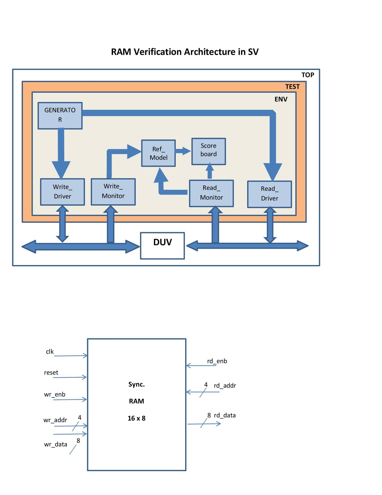

# RAM_VERIFICATION_SV

## Introduction
An environment written in System Verilog to verify a dual port RAM module. The environment consists of a generator, driver, monitor, reference board, and score board. Read and write operations have their own driver and monitor. An interface, and multiple mail boxes are used for communication with the DUT and among the components. The whole environment is OOP based.

## Transition class 
This class is resposible to carry read-write adderesses & data, reset, constraints, and enable signal. The mail boxes uses this class to carry information between components and interface.

## Generator Class
This class is responsible for generating random adderess and data to write in. The generated data is put into two mailboxes, one goes into the write driver, the other goes into the read driver.

## Drivers
Two drivers are used in this environment. The write driver takes the generated data from the mailbox and puts it into the interface. The interface gives the value to the DUT. The read driver gets the generated data from mailbox and puts it into the interface.

## Monitors
Two monitors are used in this environment. One for write, which consists of two mailboxes, one takes the value from the interface, the other supplies it to the reference model. And the other one for read, this also consists of two mailboxes, one takes the values from the interface, the other gives it the score board.

## Reference Model
The reference model is used to write the data in a local memory, which is later used by the score board to compare it with the DUT values. It consists of two mail boxes one to take the values from write monitor, the other gives it to the score board.

## Score Board
The score board compares the values from local memory to the values in read monitor. If the value matches then we conclude that correct data is written in DUT, otherwise not.

## Simulation
There are two files to run the simulation in QustaSim. The run_simu.do is for QuestaSim 10.0b. The run_simu2.do is for later versions of QuestaSim. 

## Test Cases
Five test cases are written for this project. Test case names are as follows **RAM_write_read** , **RAM_write** , **RAM_read_reset** , **RAM_write_reset** , and **RAM_write_read_reset** .

